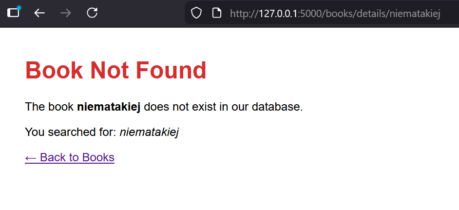
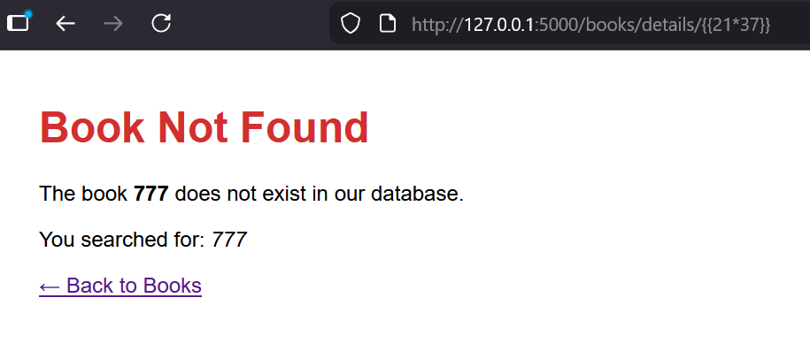
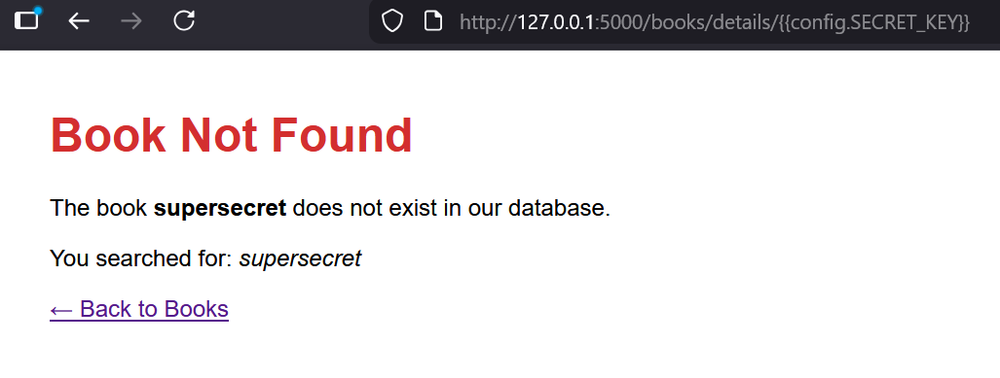
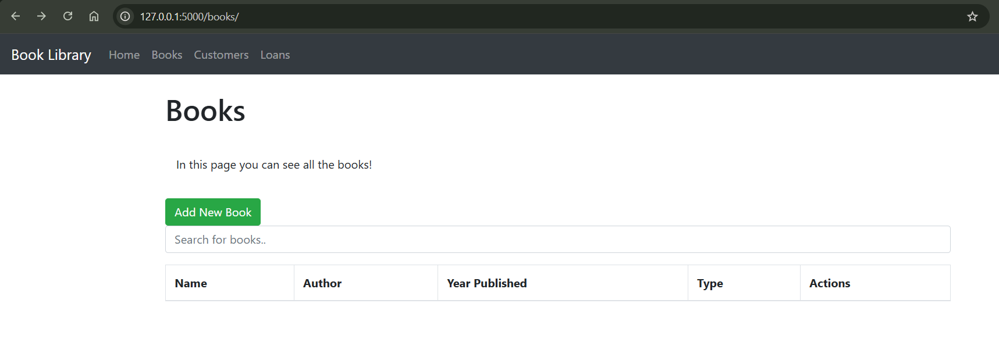
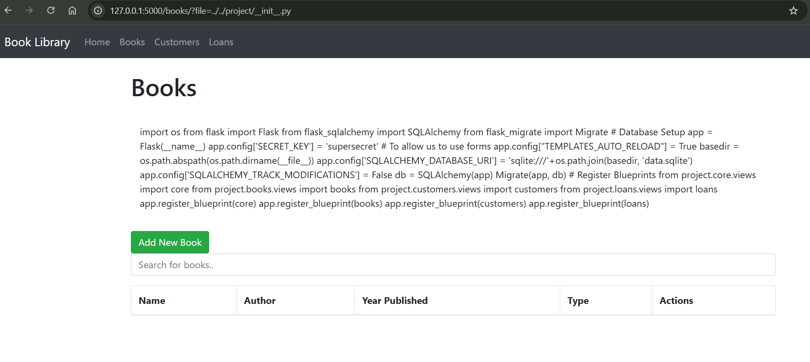

# Zadanie 2

## SSTI

Stworzony zestał dodatkowy ekran dla nieznalezionych książek. Wprowadzono podatność SSTI (Server-Side Template Injection) polegającą na bezpośrednim wstawieniu danych użytkownika (`book_name`) do template stringa, który jest następnie renderowany przez `render_template_string()`. W funkcji `get_book_details()` w pliku `project/books/views.py`.

**Przykładowe exploity:**

- `{{7*7}}` - wykonuje mnożenie, zwraca `49`
- `{{config.SECRET_KEY}}` - wyciąga klucz sekretny aplikacji
- `{{''.__class__.__mro__[1].__subclasses__()}}` - lista dostępnych klas

### Screeny podatności:

#### 1. Normalne użycie ekranu


_Normalne wyświetlenie strony błędu dla nieistniejącej książki_

#### 2. Wstrzyknięcie kodu


_Wstrzyknięcie mnożenia w parametrze URL powoduje wykonanie kodu Jinja2 i wyświetlenie wyniku zamiast tekstu_

#### 3. Wstrzyknięcie wydobycia klucza ({{config.SECRET_KEY}})


_Wstrzyknięcie `{{config.SECRET_KEY}}` pozwala na wyciągnięcie wrażliwego klucza sekretnego aplikacji Flask_

## Path Traversal

Do ekranu wyświetlania listy książek dodano krótki opis strony, pobierany z katalogu `static`. W funkcji `list_books()` w pliku `project/books/views.py` wprowadzono podatność Path Traversal polegającą na możliwym uzyskaniu dostępu do dowolnego pliku z katalogu projektu przy wskazaniu odpowiedniego URL. Dodany kod nie weryfikuje nazwy czytanego pliku, co pozwala na wskazanie ścieżki spoza katalogu `static` i wyświetlenie wrażliwych skryptów aplikacji.

**Przykładowe exploity:**

- `?file=../../project/__init__.py` - wyświetla plik konfiguracyjny aplikacji Flask
- `?file=../../project/books/views.py` - wyświetla kod i logikę działania ekranu

### Screeny podatności:

#### 1. Normalne użycie ekranu


_Normalne wyświetlenie domyślnego, poprawnego opisu do ekranu listy książek_

#### 2. Manipulacja ścieżką pliku


_Wymuszenie ścieżki pliku `?file=../../project/__init__.py` pozwala na wyświetlenie konfiguracji aplikacji Flask i pozyskanie wrażliwego klucza sekretnego_

---

To run app

```shell
docker build -t task1-python .
docker run -p 5000:5000 task1-python
```

# 📚 Book Library App 📚

- Python Flask full stack book library application with full modularity.
- Each entity has its own files seperated (forms.py, models.py, views.py, HTML, CSS, JavaScript).
- Database will be generated and updated automatically.

## 🚀 Features 🚀

- **Dashboard:**
  - Read, add, edit, and delete books.
  - Read, add, edit, and delete customers.
  - Read, add and delete loans.

- **Search Functionality:**
  - Easily search for books by name.
  - Easily search for customers by name.
  - Easily search for loans by name.

- **Responsive Design:**
  - Provides a seamless user experience across various devices.

## 🛠️ Technologies Used 🛠️

- **Frontend:**
  - HTML
  - CSS
  - Bootstrap
  - JavaScript
  - Axios

- **Backend:**
  - Python
  - Flask
  - JSON

- **Database:**
  - SQL
  - SQLAlchemy

## 🔧 Installation 🔧

1. Clone the repository:
   git clone (https://github.com/MohammadSatel/Flask_Book_Library.git)

2. Create a virtual enviroment:
   py -m venv (virtual enviroment name)
3. Activate the virtual enviroment:
   (virtual enviroment name)\Scripts\activate

4. Install needed packages:
   pip install -r requirements.txt

5. run the main app:
   py app.py (your path/Flask_Book_Library/app.py)

6. Connect to the server:
   Running on (http://127.0.0.1:5000)

7. Enjoy the full stack book library app with CRUD and DB.
